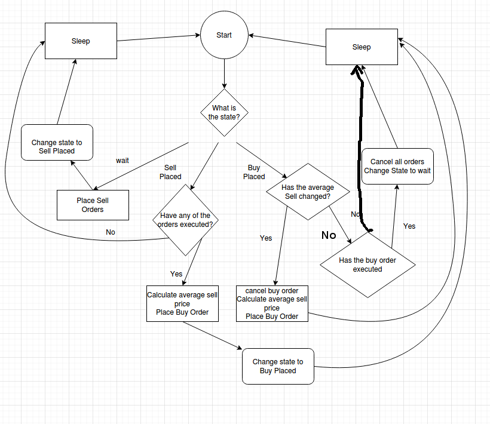

# Toy Python Trading Bot

Here you will find `main.py` which is a python script that acts as a trading bot.

These scripts are provided as is and without warranty.  

The script has a flow illustrated by the following flow chart:

There are three states of this bot.

*  `wait`: which is when there are no orders are placed.
*  sale phase (`sp`): which is when sell orders have been placed but none have executed.
*  buy phase (`bp`): some of the sell orders have been executed and a buy order to buy back has been made.

When the buy order fully executes the bot returns to the `wait` phase.

## Installation

I make a python3 virtual environment and install
[ccxt](https://github.com/ccxt/ccxt). Then I install a
cronjob that will run `main.py` every 15 minutes.

## Log of Actual Trading Data

The bot employs a conservative trading strategy.  A log of actual trading is
provided at `pro.log`.

## Mainly Only Good for Testing

This script was mainly for testing purposes and has provided data
that will allow for a better bot.  I consider this a nice first attempt,
and am only providing this to illustrate the thought process that led to
the [next version](https://github.com/DarrenTa/botv1).

## Math Behind Trading strategy

The general idea is that the sell orders are placed so that the average sell price goes up linerally with the price.  The bot will then buy at a percentage 
below the average price that percentage minus fees would be the profit.  

[Here's a write up about why the math works out.](https://www.darrentapp.com/pdfs/weightedsum.pdf)
This is not the exact sequence used in this bot, but the intention is that the same property will hold. 

I avoid what is generally refereed to as technical analysis. This bot might fit in as a regression to the mean strategy. As the price pops up 
it will eventually regress to the mean of previous prices. 

Note that this bot was made expecting the Dash price would increase.  If I thought the dash price would decrease I would use USD to buy dash at different levels and sell above the average buy. That's on the to do list, toward the bottom.

## Improvements

Note the bot was hung for quite some time.  It had sell orders that never executed.
Finally they executed.  Intervention could have arrested this latent period.
However, my [next approach](https://github.com/DarrenTa/botv1) will be to completely rewrite this bot to improve
profitability.  
